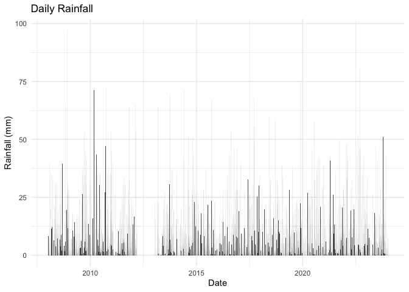

<!-- README.md is generated from README.Rmd. Please edit that file -->

# `climecol`

<!-- badges: start -->

[](https://github.com/jbaafi/climecol/actions/workflows/R-CMD-check.yaml)
[](https://jbaafi.github.io/climecol/)
[](https://lifecycle.r-lib.org/articles/stages.html#experimental)
<!-- badges: end -->

## Overview

`climecol` provides tools for archiving, cleaning, analyzing, and
visualizing weather and climate data for ecological and
infectious-disease modeling. It ships curated daily weather data and
simple helpers for quick plotting and analysis.

## Installation

You can install the development version of `climecol` from
[GitHub](https://github.com/) with:

``` r
# install.packages("devtools")
devtools::install_github("jbaafi/climecol")
```

(Alternatively: `pak::pak("jbaafi/climecol")`.)

## Photoperiod (daylength)

The package includes fast, dependency-free photoperiod helpers based on
a standard solar-geometry approximation (Forsythe et al., 1995). These
return **hours of daylight** from date and latitude only—ideal as a
smooth seasonal driver for ecological models.

### Functions

- `daylength_f95(date, lat)` → numeric vector of daylight hours

- `photoperiod_year(year, lat = NULL, location = NULL, aggregate = c("none","month"))`

  - Supply either `lat` **or** a built-in `location` key  
  - `aggregate = "month"` returns monthly means (12 rows)

- `photoperiod_sites()` → named vector of built-in locations and
  latitudes  
  *(keys are matched case-insensitively; punctuation/spacing ignored)*

Quick examples

``` r
library(climecol)

# Daily photoperiod for 2024 at St. John's (NL) via location
pp_nl <- photoperiod_year(2024, location = "St John's")
head(pp_nl)
#>         date daylength_hours   lat location
#> 1 2024-01-01        8.517220 47.56 st_johns
#> 2 2024-01-02        8.532937 47.56 st_johns
#> 3 2024-01-03        8.549903 47.56 st_johns
#> 4 2024-01-04        8.568104 47.56 st_johns
#> 5 2024-01-05        8.587527 47.56 st_johns
#> 6 2024-01-06        8.608155 47.56 st_johns

# Monthly mean photoperiod at 47.56°N
photoperiod_year(2024, lat = 47.56, aggregate = "month")
#>          date daylength_hours   lat  location
#> 1  2024-01-01        8.916550 47.56 lat_47.56
#> 2  2024-02-01       10.207203 47.56 lat_47.56
#> 3  2024-03-01       11.887952 47.56 lat_47.56
#> 4  2024-04-01       13.652182 47.56 lat_47.56
#> 5  2024-05-01       15.161088 47.56 lat_47.56
#> 6  2024-06-01       15.912512 47.56 lat_47.56
#> 7  2024-07-01       15.487501 47.56 lat_47.56
#> 8  2024-08-01       14.115072 47.56 lat_47.56
#> 9  2024-09-01       12.384641 47.56 lat_47.56
#> 10 2024-10-01       10.635663 47.56 lat_47.56
#> 11 2024-11-01        9.175674 47.56 lat_47.56
#> 12 2024-12-01        8.490440 47.56 lat_47.56

# Saint John (NB) vs St. John's (NL) — distinct cities
photoperiod_year(2024, location = "Saint John", aggregate = "month")
#>          date daylength_hours   lat   location
#> 1  2024-01-01        9.172983 45.27 saint_john
#> 2  2024-02-01       10.354056 45.27 saint_john
#> 3  2024-03-01       11.902529 45.27 saint_john
#> 4  2024-04-01       13.528932 45.27 saint_john
#> 5  2024-05-01       14.910968 45.27 saint_john
#> 6  2024-06-01       15.593079 45.27 saint_john
#> 7  2024-07-01       15.207900 45.27 saint_john
#> 8  2024-08-01       13.954218 45.27 saint_john
#> 9  2024-09-01       12.360833 45.27 saint_john
#> 10 2024-10-01       10.748119 45.27 saint_john
#> 11 2024-11-01        9.409230 45.27 saint_john
#> 12 2024-12-01        8.785616 45.27 saint_john
photoperiod_year(2024, location = "St John's", aggregate = "month")
#>          date daylength_hours   lat location
#> 1  2024-01-01        8.916550 47.56 st_johns
#> 2  2024-02-01       10.207203 47.56 st_johns
#> 3  2024-03-01       11.887952 47.56 st_johns
#> 4  2024-04-01       13.652182 47.56 st_johns
#> 5  2024-05-01       15.161088 47.56 st_johns
#> 6  2024-06-01       15.912512 47.56 st_johns
#> 7  2024-07-01       15.487501 47.56 st_johns
#> 8  2024-08-01       14.115072 47.56 st_johns
#> 9  2024-09-01       12.384641 47.56 st_johns
#> 10 2024-10-01       10.635663 47.56 st_johns
#> 11 2024-11-01        9.175674 47.56 st_johns
#> 12 2024-12-01        8.490440 47.56 st_johns

# List built-in sites
photoperiod_sites()
#>   st_johns saint_john     kumasi    nairobi  cape_town ain_mahbel 
#>      47.56      45.27       6.69      -1.29     -33.92      34.24
```

A simple plot of daylength over the year:

``` r
plot(pp_nl$date, pp_nl$daylength_hours, type = "l",
     xlab = "Date", ylab = "Daylength (hours)",
     main = "Photoperiod at St. John's, NL (2024)")
```



### Notes

- Inputs like `"St John's"`, `"st_johns"`, and `"St.Johns"` all resolve
  to the same NL site (`st_johns`).
- `"Saint John"` / `"st john"` resolves to NB (`saint_john`).
- If you pass `lat` (no `location`), the output is labeled as
  `lat_<value>`.

## Example

Load the package and explore the included Newfoundland dataset
(2008–2023):

``` r
library(climecol)

# Load dataset
data(weather_nl)

# Peek at structure
dplyr::glimpse(weather_nl)
#> Rows: 5,844
#> Columns: 10
#> $ Date      <date> 2008-01-01, 2008-01-02, 2008-01-03, 2008-01-04, 2008-01-05,…
#> $ Year      <int> 2008, 2008, 2008, 2008, 2008, 2008, 2008, 2008, 2008, 2008, …
#> $ Month     <int> 1, 1, 1, 1, 1, 1, 1, 1, 1, 1, 1, 1, 1, 1, 1, 1, 1, 1, 1, 1, …
#> $ Day       <int> 1, 2, 3, 4, 5, 6, 7, 8, 9, 10, 11, 12, 13, 14, 15, 16, 17, 1…
#> $ T_min_C   <dbl> -6.6, -8.1, -11.0, -12.6, -9.6, -10.5, -4.2, -1.2, -2.5, 0.0…
#> $ T_max_C   <dbl> 1.6, 2.0, -0.4, -5.9, -2.4, -2.5, 2.5, 3.8, 0.5, 9.5, 0.5, 7…
#> $ T_mean_C  <dbl> -2.5, -3.1, -5.7, -9.3, -6.0, -6.5, -0.9, 1.3, -1.0, 4.8, -1…
#> $ Rain_mm   <dbl> 0.2, 0.0, 0.2, 0.0, 0.0, 0.0, 0.0, 0.6, 0.8, 8.2, 0.0, 11.0,…
#> $ Precip_mm <dbl> 2.0, 4.5, 0.2, 0.0, 1.6, 2.2, 0.0, 0.6, 1.8, 8.2, 0.0, 11.0,…
#> $ Snow_cm   <dbl> 1.8, 5.0, 0.0, 0.0, 2.6, 6.4, 0.0, 0.0, 1.8, 0.0, 0.0, 0.0, …
```

Plot daily rainfall:

``` r
plot_rainfall(weather_nl)
```


> This figure was generated when knitting this README.

## Contributing

Issues and pull requests are welcome via the repo’s [issue
tracker](https://github.com/jbaafi/climecol/issues).

## Contact

If you’re interested in discussing collaborations or have questions
about `climecol`, email me at <jbaafi@mun.ca>.

## License

MIT © Joseph Baafi
