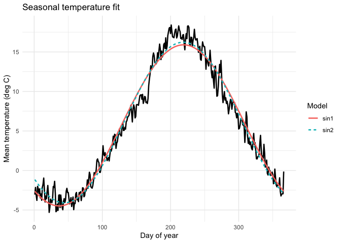

<!-- README.md is generated from README.Rmd. Please edit that file -->

# `climecol`

<!-- badges: start -->

[](https://github.com/jbaafi/climecol/actions/workflows/R-CMD-check.yaml)
[](https://jbaafi.github.io/climecol/)
[](https://lifecycle.r-lib.org/articles/stages.html#experimental)
<!-- badges: end -->

## Overview

`climecol` provides tools for archiving, cleaning, analyzing, and
visualizing weather and climate data for ecological and
infectious-disease modeling. It ships curated daily weather data and
simple helpers for quick plotting and analysis.

## Installation

You can install the development version of `climecol` from
[GitHub](https://github.com/) with:

``` r
# install.packages("devtools")
devtools::install_github("jbaafi/climecol")
```

(Alternatively: `pak::pak("jbaafi/climecol")`.)

## Data Importation

``` r
library(climecol)
wx <- read_weather_csv("/Users/jbaafi/Desktop/data.csv")
qa <- validate_weather(wx, temp_bounds = c(-50, 50), rain_max = 150, snow_max = 60)
qa$summary
```

## Gap handling and imputation

The package provides tools to handle gaps in weather records:

- **`complete_daily_calendar()`** ensures a full daily date sequence per
  station, making gaps explicit.  
- **`summarise_gaps()`** quantifies missingness, coverage, and longest
  contiguous gaps.  
- **`impute_weather()`** offers lightweight fillers (last observation
  carried forward, linear, or spline).

Together, these helpers make it easy to prepare consistent daily time
series for downstream climate-driven modeling.

## Photoperiod (daylength)

The package includes fast, dependency-free photoperiod helpers based on
a standard solar-geometry approximation (Forsythe et al., 1995). These
return **hours of daylight** from date and latitude only—ideal as a
smooth seasonal driver for ecological models.

### Functions

- `daylength_f95(date, lat)` → numeric vector of daylight hours

- `photoperiod_year(year, lat = NULL, location = NULL, aggregate = c("none","month"))`

  - Supply either `lat` **or** a built-in `location` key  
  - `aggregate = "month"` returns monthly means (12 rows)

- `photoperiod_sites()` → named vector of built-in locations and
  latitudes  
  *(keys are matched case-insensitively; punctuation/spacing ignored)*

Quick examples

``` r
library(climecol)

# Daily photoperiod for 2024 at St. John's (NL) via location
pp_nl <- photoperiod_year(2024, location = "St John's")
head(pp_nl)
#>         date daylength_hours   lat location
#> 1 2024-01-01        8.517220 47.56 st_johns
#> 2 2024-01-02        8.532937 47.56 st_johns
#> 3 2024-01-03        8.549903 47.56 st_johns
#> 4 2024-01-04        8.568104 47.56 st_johns
#> 5 2024-01-05        8.587527 47.56 st_johns
#> 6 2024-01-06        8.608155 47.56 st_johns

# Monthly mean photoperiod at 47.56°N
photoperiod_year(2024, lat = 47.56, aggregate = "month")
#>          date daylength_hours   lat  location
#> 1  2024-01-01        8.916550 47.56 lat_47.56
#> 2  2024-02-01       10.207203 47.56 lat_47.56
#> 3  2024-03-01       11.887952 47.56 lat_47.56
#> 4  2024-04-01       13.652182 47.56 lat_47.56
#> 5  2024-05-01       15.161088 47.56 lat_47.56
#> 6  2024-06-01       15.912512 47.56 lat_47.56
#> 7  2024-07-01       15.487501 47.56 lat_47.56
#> 8  2024-08-01       14.115072 47.56 lat_47.56
#> 9  2024-09-01       12.384641 47.56 lat_47.56
#> 10 2024-10-01       10.635663 47.56 lat_47.56
#> 11 2024-11-01        9.175674 47.56 lat_47.56
#> 12 2024-12-01        8.490440 47.56 lat_47.56

# Saint John (NB) vs St. John's (NL) — distinct cities
photoperiod_year(2024, location = "Saint John", aggregate = "month")
#>          date daylength_hours   lat   location
#> 1  2024-01-01        9.172983 45.27 saint_john
#> 2  2024-02-01       10.354056 45.27 saint_john
#> 3  2024-03-01       11.902529 45.27 saint_john
#> 4  2024-04-01       13.528932 45.27 saint_john
#> 5  2024-05-01       14.910968 45.27 saint_john
#> 6  2024-06-01       15.593079 45.27 saint_john
#> 7  2024-07-01       15.207900 45.27 saint_john
#> 8  2024-08-01       13.954218 45.27 saint_john
#> 9  2024-09-01       12.360833 45.27 saint_john
#> 10 2024-10-01       10.748119 45.27 saint_john
#> 11 2024-11-01        9.409230 45.27 saint_john
#> 12 2024-12-01        8.785616 45.27 saint_john
photoperiod_year(2024, location = "St John's", aggregate = "month")
#>          date daylength_hours   lat location
#> 1  2024-01-01        8.916550 47.56 st_johns
#> 2  2024-02-01       10.207203 47.56 st_johns
#> 3  2024-03-01       11.887952 47.56 st_johns
#> 4  2024-04-01       13.652182 47.56 st_johns
#> 5  2024-05-01       15.161088 47.56 st_johns
#> 6  2024-06-01       15.912512 47.56 st_johns
#> 7  2024-07-01       15.487501 47.56 st_johns
#> 8  2024-08-01       14.115072 47.56 st_johns
#> 9  2024-09-01       12.384641 47.56 st_johns
#> 10 2024-10-01       10.635663 47.56 st_johns
#> 11 2024-11-01        9.175674 47.56 st_johns
#> 12 2024-12-01        8.490440 47.56 st_johns

# List built-in sites
photoperiod_sites()
#>   st_johns saint_john     kumasi    nairobi  cape_town ain_mahbel 
#>      47.56      45.27       6.69      -1.29     -33.92      34.24
```

A simple plot of daylength over the year:

``` r
plot(pp_nl$date, pp_nl$daylength_hours, type = "l",
     xlab = "Date", ylab = "Daylength (hours)",
     main = "Photoperiod at St. John's, NL (2024)")
```



### Notes

- Inputs like `"St John's"`, `"st_johns"`, and `"St.Johns"` all resolve
  to the same NL site (`st_johns`).
- `"Saint John"` / `"st john"` resolves to NB (`saint_john`).
- If you pass `lat` (no `location`), the output is labeled as
  `lat_<value>`.

## Example

Load the package and explore the included Newfoundland dataset
(2008–2023):

``` r
library(climecol)

# Load dataset
data(weather_nl)

# Peek at structure
dplyr::glimpse(weather_nl)
#> Rows: 5,844
#> Columns: 13
#> $ date         <date> 2008-01-01, 2008-01-02, 2008-01-03, 2008-01-04, 2008-01-05, 2008-01-06, 2008-01-07, 2008-01-08, 2008-01-09, 2008-01-10, 2008-01…
#> $ Year         <int> 2008, 2008, 2008, 2008, 2008, 2008, 2008, 2008, 2008, 2008, 2008, 2008, 2008, 2008, 2008, 2008, 2008, 2008, 2008, 2008, 2008, 20…
#> $ Month        <int> 1, 1, 1, 1, 1, 1, 1, 1, 1, 1, 1, 1, 1, 1, 1, 1, 1, 1, 1, 1, 1, 1, 1, 1, 1, 1, 1, 1, 1, 1, 1, 2, 2, 2, 2, 2, 2, 2, 2, 2, 2, 2, 2,…
#> $ Day          <int> 1, 2, 3, 4, 5, 6, 7, 8, 9, 10, 11, 12, 13, 14, 15, 16, 17, 18, 19, 20, 21, 22, 23, 24, 25, 26, 27, 28, 29, 30, 31, 1, 2, 3, 4, 5…
#> $ tmin_c       <dbl> -6.6, -8.1, -11.0, -12.6, -9.6, -10.5, -4.2, -1.2, -2.5, 0.0, -3.0, -2.7, -4.3, -5.3, -2.7, -2.0, -4.8, -8.4, -5.8, -7.4, -15.6,…
#> $ tmax_c       <dbl> 1.6, 2.0, -0.4, -5.9, -2.4, -2.5, 2.5, 3.8, 0.5, 9.5, 0.5, 7.0, 5.0, -2.6, 0.9, 0.1, -1.6, -1.9, 2.0, -3.8, -4.1, -9.8, 4.0, -3.…
#> $ tavg_c       <dbl> -2.5, -3.1, -5.7, -9.3, -6.0, -6.5, -0.9, 1.3, -1.0, 4.8, -1.3, 2.2, 0.4, -4.0, -0.9, -1.0, -3.2, -5.2, -1.9, -5.6, -9.9, -12.5,…
#> $ rain_mm      <dbl> 0.2, 0.0, 0.2, 0.0, 0.0, 0.0, 0.0, 0.6, 0.8, 8.2, 0.0, 11.0, 0.4, 0.0, 4.5, 0.0, 0.0, 0.0, 0.0, 0.0, 0.0, 0.0, 6.4, 0.0, 0.0, 0.…
#> $ precip_mm    <dbl> 2.0, 4.5, 0.2, 0.0, 1.6, 2.2, 0.0, 0.6, 1.8, 8.2, 0.0, 11.0, 0.4, 1.0, 11.6, 0.2, 0.0, 0.0, 2.0, 20.8, 2.4, 0.0, 15.4, 0.0, 15.2…
#> $ snow_cm      <dbl> 1.8, 5.0, 0.0, 0.0, 2.6, 6.4, 0.0, 0.0, 1.8, 0.0, 0.0, 0.0, 0.0, 1.0, 8.6, 0.8, 0.0, 0.0, 2.0, 24.6, 2.6, 0.0, 10.4, 0.0, 22.2, …
#> $ Station.Name <chr> "ST JOHN'S A", "ST JOHN'S A", "ST JOHN'S A", "ST JOHN'S A", "ST JOHN'S A", "ST JOHN'S A", "ST JOHN'S A", "ST JOHN'S A", "ST JOHN…
#> $ Climate.ID   <dbl> 8403506, 8403506, 8403506, 8403506, 8403506, 8403506, 8403506, 8403506, 8403506, 8403506, 8403506, 8403506, 8403506, 8403506, 84…
#> $ station      <chr> "ST JOHN'S A", "ST JOHN'S A", "ST JOHN'S A", "ST JOHN'S A", "ST JOHN'S A", "ST JOHN'S A", "ST JOHN'S A", "ST JOHN'S A", "ST JOHN…
```

## Photoperiod fits (seasonal curve)

``` r
# Option A: generate photoperiod from a location for two years and fit
res <- fit_seasonal_photo(location = "St John's",
                          years = c(2023, 2024),
                          funcs = c("sin1","sin2"),
                          plot = TRUE)
res$metrics
#> # A tibble: 2 × 3
#>   model   AIC    R2
#>   <chr> <dbl> <dbl>
#> 1 sin1  -934. 0.999
#> 2 sin2  -943. 0.999
if (!is.null(res$plot)) print(res$plot)
```


``` r

# Option B: provide your own photoperiod data frame
# df <- data.frame(date = as.Date("2023-01-01") + 0:729,
#                  photoperiod_hours = 12 + 6*cos(2*pi*(1:730)/365))
# fit_seasonal_photo(df = df, funcs = "sin1", plot = TRUE)

# Custom model example
res2 <- fit_seasonal_photo(
  location = "St John's",
  years = c(2023, 2024),
  funcs = "sin1",
  custom = list(
    cos1 = list(
      formula = avg_photo ~ a + b * cos(2*pi*day_of_year/365),
      start   = list(a = 12, b = 6)
    )
  )
)
res2$metrics
#> # A tibble: 2 × 3
#>   model   AIC    R2
#>   <chr> <dbl> <dbl>
#> 1 sin1  -934. 0.999
#> 2 cos1   495. 0.967
```

## Rainfall data

Plot daily rainfall:

``` r
plot_rainfall(weather_nl)
```


> This figure was generated when knitting this README.

### Seasonal temperature fitting

``` r
data(weather_nl)
res <- fit_seasonal_temp(weather_nl, funcs = c("sin1","sin2"), plot = TRUE)
res$metrics
#> # A tibble: 2 × 3
#>   model   AIC    R2
#>   <chr> <dbl> <dbl>
#> 1 sin1  1204. 0.971
#> 2 sin2  1159. 0.975
#> # A tibble: 2 x 3
#>   model   AIC    R2
#>   <chr> <dbl> <dbl>
#> 1 sin1   ...   ...
#> 2 sin2   ...   ...

# plot overlay (observed vs fitted)
res$plot
```


## Custom seasonal temperature models

In addition to the built-in sinusoidal models (`sin1`, `cos1`, etc.),
you can also pass your own formula to `fit_seasonal_temp()` via the
`funcs` argument.

For example, suppose we define our custom function:

``` r
#Standardize column names

df <- normalize_weather_names(weather_nl)

# Define your custom model (formula uses mean_temp ~ ... and day_of_year)
custom_models <- list(
  quad = list(
    formula = mean_temp ~ a + b * day_of_year + c * I(day_of_year^2),
    start   = list(a = mean(df$tavg_c, na.rm = TRUE), b = 0, c = 0)  # <- REQUIRED
  )
)

# Fit: built-ins via `funcs=`, user models via `custom=`
res <- fit_seasonal_temp(
  df,
  funcs  = "sin1",     # optional: keep a built-in for comparison
  custom = custom_models,
  plot   = TRUE
)

# 5) Results
res$metrics   # AIC and R2 per model
#> # A tibble: 2 × 3
#>   model   AIC    R2
#>   <chr> <dbl> <dbl>
#> 1 sin1  1204. 0.971
#> 2 quad  1984. 0.758
res$plot      # overlay plot
```


## 🌧️ Stochastic Rainfall Sampling by Month

The function `sample_rainfall_by_month()` generates a stochastic **daily
rainfall time series** while preserving the **monthly seasonality**
observed in the historical record.  
This allows you to produce rainfall inputs for simulation models that
retain realistic wet/dry season structure without imposing a statistical
distribution.

``` r
library(climecol)
data(weather_nl)

# Define target dates to simulate
set.seed(123)
dates <- seq.Date(as.Date("2012-01-01"), as.Date("2012-01-15"), by = "day")

# Sample synthetic daily rainfall using historical monthly pools
rain_sim <- sample_rainfall_by_month(dates, weather_nl)

# Preview
head(data.frame(date = dates, rain_sim_mm = rain_sim), 10)
#>          date rain_sim_mm
#> 1  2012-01-01         0.0
#> 2  2012-01-02         0.0
#> 3  2012-01-03         0.0
#> 4  2012-01-04         0.0
#> 5  2012-01-05         0.4
#> 6  2012-01-06         0.0
#> 7  2012-01-07         0.0
#> 8  2012-01-08         0.0
#> 9  2012-01-09         0.0
#> 10 2012-01-10         0.0
```

``` r
plot(dates, rain_sim, type = "h", lwd = 3,
     xlab = "Date", ylab = "Simulated rainfall (mm)",
     main = "Daily rainfall sampled by month")
```


The sampled values are drawn from the same-month historical rainfall
distribution, so wet and dry months retain their distinct variability
patterns.

## Contributing

Issues and pull requests are welcome via the repo’s [issue
tracker](https://github.com/jbaafi/climecol/issues).

## Contact

If you’re interested in discussing collaborations or have questions
about `climecol`, email me at <jbaafi@mun.ca>.

## License

MIT © Joseph Baafi
